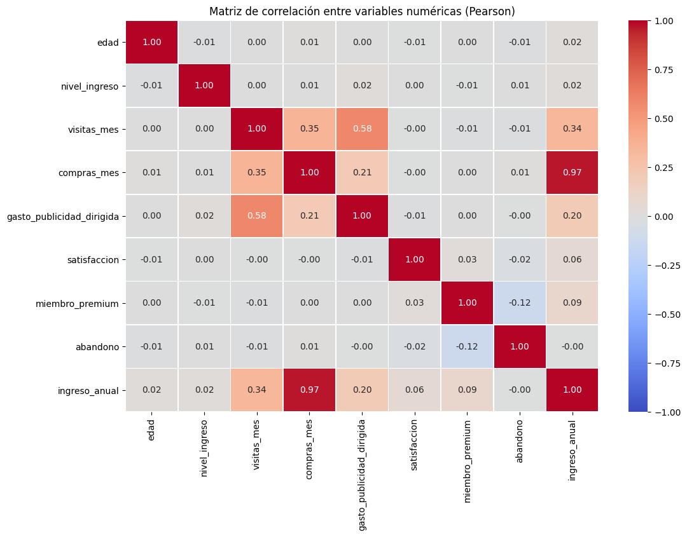
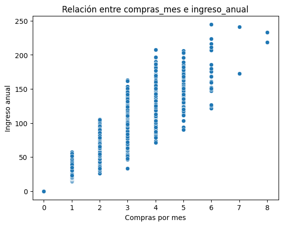
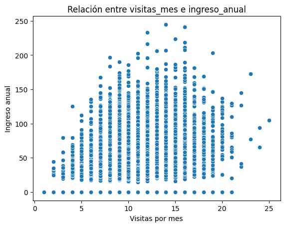
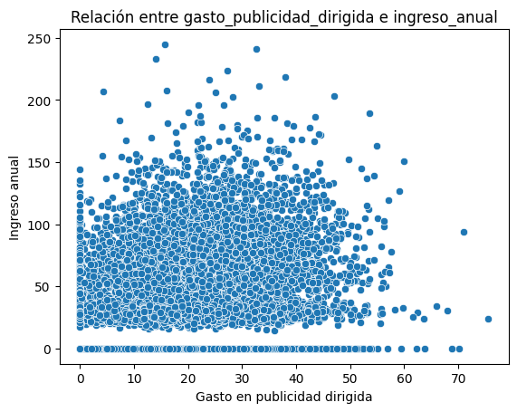

# NovaRetail+ — Drivers de Comportamiento

Análisis correlacional del comportamiento de clientes de NovaRetail+, una plataforma de e-commerce en Latinoamérica, para identificar qué factores están más asociados con el ingreso anual generado por cliente.

## Contexto

El equipo de Crecimiento y Retención de NovaRetail+ buscaba entender qué variables de comportamiento (visitas, compras, publicidad dirigida, satisfacción, membresía premium, abandono, edad, región, tipo de dispositivo) se asocian más fuertemente con `ingreso_anual`, usando un dataset de 15,000 clientes durante 2024. El análisis es exploratorio y correlacional, no causal.

## Metodología

- Exploración y limpieza de datos, documentando supuestos sobre variables numéricas, binarias y categóricas
- Visualización de relaciones: heatmap de correlaciones y scatterplots para los pares de variables más relevantes
- Coeficientes de correlación según el tipo de variable:
  - **Pearson / Spearman** para variables numéricas
  - **Punto-biserial** para variables binarias vs. ingreso anual
  - **V de Cramér** para variables categóricas
- Interpretación responsable de cada hallazgo, señalando explícitamente qué no se puede concluir (asociación ≠ causalidad)

## Resultados principales

- **Compras mensuales** es, por mucho, el driver más asociado al ingreso anual (Pearson ≈ 0.96–0.97) — el "motor transaccional" del negocio
- **Visitas mensuales** muestra una asociación moderada (Pearson ≈ 0.34)
- **Gasto en publicidad dirigida** tiene una asociación débil (Pearson ≈ 0.20), con alta variabilidad
- **Membresía premium** presenta una asociación positiva pero débil (r punto-biserial ≈ 0.09)
- **Satisfacción, edad, nivel de ingreso, región, tipo de dispositivo y abandono** no muestran asociación relevante con el ingreso anual (correlaciones cercanas a 0, V de Cramér ≈ 0 en todos los cruces categóricos)

## Recomendaciones de negocio

- Priorizar estrategias de retención enfocadas en frecuencia de compra (programas de lealtad, incentivos a la recurrencia)
- Revisar los criterios de segmentación de la publicidad dirigida y validar su efectividad con experimentación controlada (A/B testing) antes de asumir causalidad
- Usar el estatus premium como variable de segmentación para análisis adicionales, no como palanca directa de ingreso
- Enfocar la segmentación en variables de comportamiento más que en variables demográficas tradicionales (edad, región), que no mostraron asociación con el ingreso

## Limitaciones y próximos pasos

Análisis de naturaleza correlacional, no causal; existen variables externas no incluidas (condiciones económicas, promociones, competencia) que podrían influir en los resultados. Como siguientes pasos se sugiere clustering (K-Means) para segmentar clientes, experimentación controlada (A/B) y modelos de regresión o árboles de decisión para profundizar en la relación multivariable con el ingreso.

## Visualizaciones

| | |
|---|---|
|  |  |
|  |  |

## Herramientas

Python (pandas, numpy, seaborn, matplotlib) en Jupyter Notebook.

## Estructura del repo

```
novaretail-behavior-drivers/
├── NovaRetail_Drivers_Comportamiento.ipynb
├── novaretail_comportamiento_clientes_2024.xlsx
├── images/
└── README.md
```
